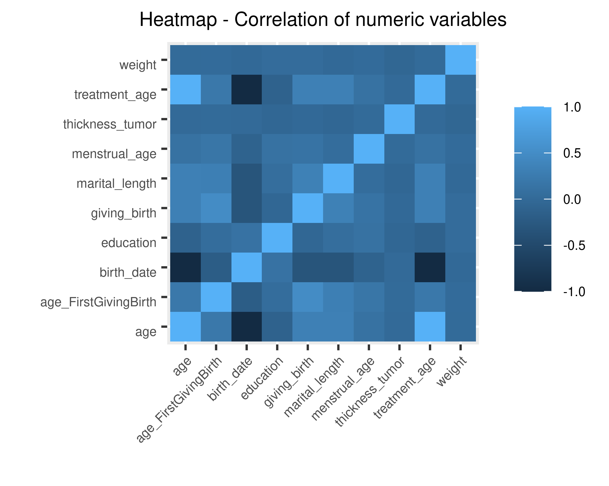

```{r setup, include=FALSE}
knitr::opts_chunk$set(echo = FALSE)

```

## Introduction


# Materials and methods
## Materials
We are working with a dataset about Breast Cancer that we have obtained from this website: <https://www.kaggle.com/>

<span style="font-weight:bold; color:red;">This text will appear red and bold</span>


## Cleaning the data
The data showed the following problems:

- Some columns had 3 values (0, 1, 2), but in the dataset description it appears that they should have only two values (0, 1) so we have considered that 1 and 2 are equal to 1
- Some columns had a carriage return we should delete (/r/n)
- There was a birth date with 3 characters instead of 4.
- There was a blood type 44, it doesn't make any sense.

For statistical analysis, we have chosen only woman. 

## Augmenting the data

- We have added more columns to improve the information
- We have changed the type of the columns

## Statistical analysis and plots of the data

```{r, fig.cap="Heat map, correlation of numeric variables", out.width = "600px"}

```


# Results {.build}
## Results {.build}
# Discussion
## Discussion
# Conclusion

---

We have reached the following conclusions


---
<div class="final">Thanks for your attention</div>


## R Markdown

This is an R Markdown presentation. Markdown is a simple formatting syntax for authoring HTML, PDF, and MS Word documents. For more details on using R Markdown see <http://rmarkdown.rstudio.com>.

When you click the **Knit** button a document will be generated that includes both content as well as the output of any embedded R code chunks within the document.


## Slide with R Output

```{r cars, fig.cap="A scatterplot.", echo = TRUE}
summary(cars)
```


