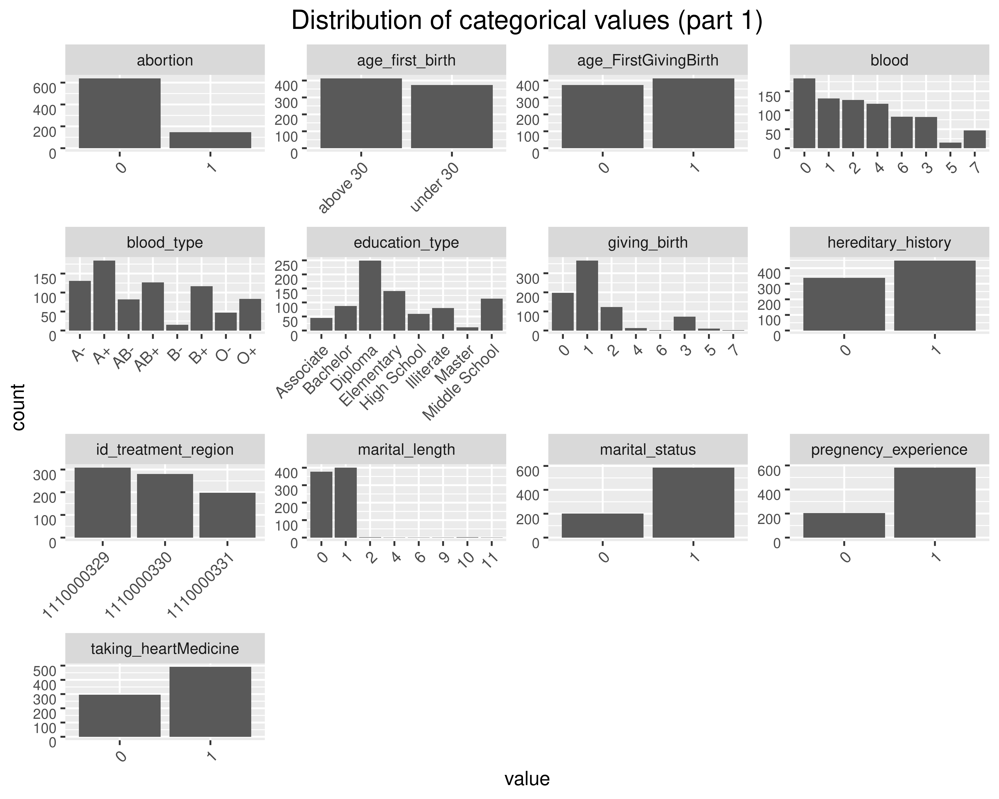

```{r setup, include=FALSE}
knitr::opts_chunk$set(echo = FALSE)
library(tidyverse)
clean_augmented_data <- read_csv(file = "clean_augmented_data.csv")
```

## Introduction


# Materials and methods
## Materials
We are working with a dataset about Breast Cancer that we have obtained from this website: <https://www.kaggle.com/>

This is the dataset we are working with:


```{r dataset}
clean_augmented_data %>%
  select(patient_id, education_type, id_healthcenter, id_treatment_region)
```


## Cleaning the data
The data showed the following problems:

- Some columns had 3 values (0, 1, 2), but in the dataset description it appears that they should have only two values (0, 1) so we have considered that 1 and 2 are equal to 1
- Some columns had a carriage return we should delete (/r/n)
- There was a birth date with 3 characters instead of 4.
- There was a blood type 44, it doesn't make any sense.

For statistical analysis, we have chosen only **women**. 

## Augmenting the data

- We have added more columns to improve the information
- We have changed the type of the columns

## Statistical analysis and plots of the data

{width=50%}{width=50%}

# Results {.build}
## Results {.build}
# Discussion
## Discussion
# Conclusion

---

We have reached the following conclusions


---
<div class="final">Thanks for your attention</div>


